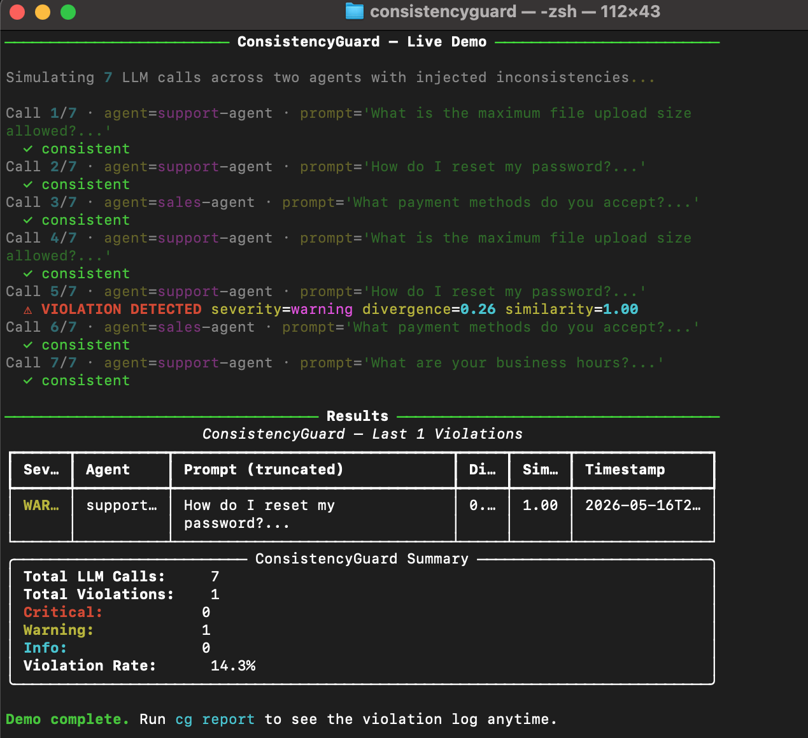

# ConsistencyGuard

**Real-time LLM output consistency monitor — detects when your AI agents give
different answers to the same question, before your users notice.**

[](https://www.python.org/)
[](LICENSE)
[](#tests)

---

## The Problem

Deploying AI agents in production reveals a problem nobody talks about enough:
**the same question gets different answers on different days.**

While researching enterprise AI agent failures, I kept running into
variations of the same story — a support agent tells one customer "no refunds
after 30 days" and tells another "full refund within 60 days." A knowledge
agent cites a policy that was updated last quarter. A sales agent quotes a
price that changed last week. No error is thrown. No alert fires. The pipeline
shows green. The damage is already done.

This is not a hallucination problem. Hallucinations are detectable — the model
makes something up and it is obviously wrong. **Inconsistency is invisible.**
The model gives a plausible answer both times. Just a different one.

The scale of the problem is significant:

- Most large enterprises now run AI agents in production across multiple business functions
- The majority have no governance or monitoring strategy covering those agents
- Individual organizations commonly manage dozens of deployed agents, many running without any logging
- Inconsistent AI outputs in regulated industries — finance, healthcare, legal — create direct compliance exposure

I looked for a cross-platform tool that detects output inconsistency in real
time across any LLM provider. Nothing existed.

**So I built ConsistencyGuard.**

---

## What Existing Tools Miss

Most LLM observability tools focus on cost, latency, and error rates.
They tell you a call succeeded — not whether it said something different
than it said yesterday to the same question.

The gap across the current ecosystem:

- **Tracing tools** record what was said but never compare it against past responses
- **Cost and latency monitors** track performance, not semantic content
- **ML drift detectors** were built for structured model outputs, not free-form text
- **Platform-specific guardrails** lock you into a single provider
- **Custom logging** captures responses but requires manual analysis to spot inconsistency

None of them answer the question that matters most in production:
**"Is my agent saying the same thing today that it said last week?"**

ConsistencyGuard is purpose-built to answer exactly that — across any LLM
provider, with zero infrastructure.

---

## How It Works

```
Your App  →  guarded_call()  →  LLM API (Anthropic / OpenAI)
                 │
                 ├─ 1. embed(prompt)          ← local MiniLM, no API cost
                 ├─ 2. similarity scan        ← SQLite, cosine similarity
                 ├─ 3. if sim > 0.92          → compare responses
                 ├─ 4. if divergence > 0.25   → CONSISTENCY VIOLATION
                 └─ 5. log + webhook + report
```

| Severity | Divergence | Meaning |
|----------|-----------|---------|
| CRITICAL | ≥ 0.40 | Responses contradict each other |
| WARNING  | ≥ 0.25 | Material difference in content |
| INFO     | ≥ 0.10 | Minor phrasing variation |

---

## Quickstart

```bash
git clone https://github.com/sameerpashasyed17-collab/consistencyguard.git
cd consistencyguard
pip install -e .
cp .env.example .env
# Add your ANTHROPIC_API_KEY to .env

# Run the zero-API-key demo first
python demo/run_demo.py

# Send a real prompt through the guard
cg check "What is the maximum file upload size?"

# View violation report
cg report
```

### Zero-API-key demo

```bash
python demo/run_demo.py
```

```
──────────── ConsistencyGuard — Live Demo ────────────

Simulating 7 LLM calls across two agents with injected inconsistencies...

Call 1/7 · agent=support-agent · prompt='What is the maximum file upload size allowed?...'
  ✓ consistent
Call 2/7 · agent=support-agent · prompt='How do I reset my password?...'
  ✓ consistent
Call 3/7 · agent=sales-agent · prompt='What payment methods do you accept?...'
  ✓ consistent
Call 4/7 · agent=support-agent · prompt='What is the maximum file upload size allowed?...'
  ⚠ VIOLATION DETECTED  severity=critical  divergence=0.51  similarity=1.00
Call 5/7 · agent=support-agent · prompt='How do I reset my password?...'
  ⚠ VIOLATION DETECTED  severity=warning   divergence=0.26  similarity=1.00
Call 6/7 · agent=sales-agent · prompt='What payment methods do you accept?...'
  ⚠ VIOLATION DETECTED  severity=warning   divergence=0.28  similarity=1.00
Call 7/7 · agent=support-agent · prompt='What are your business hours?...'
  ✓ consistent

ConsistencyGuard — Last 3 Violations
┌──────────┬───────────────┬──────────────────────────────┬─────────┬────────┐
│ Severity │ Agent         │ Prompt (truncated)           │ Diverge │ Sim    │
├──────────┼───────────────┼──────────────────────────────┼─────────┼────────┤
│ WARNING  │ sales-agent   │ What payment methods do...   │ 0.28    │ 1.00   │
│ WARNING  │ support-agent │ How do I reset my password?  │ 0.26    │ 1.00   │
│ CRITICAL │ support-agent │ What is the maximum file...  │ 0.51    │ 1.00   │
└──────────┴───────────────┴──────────────────────────────┴─────────┴────────┘

┌──────────────────── ConsistencyGuard Summary ────────────────────┐
│ Total LLM Calls:     7                                           │
│ Total Violations:    3                                           │
│ Critical:            1                                           │
│ Warning:             2                                           │
│ Info:                0                                           │
│ Violation Rate:      42.9%                                       │
└──────────────────────────────────────────────────────────────────┘
```

---

## Drop-in Integration

```python
# Before — direct API call
import anthropic
client = anthropic.Anthropic()
response = client.messages.create(model="claude-haiku-4-5-20251001",
                                   max_tokens=1024,
                                   messages=[{"role": "user", "content": prompt}])
text = response.content[0].text

# After — one import, one function, same response
from consistencyguard.proxy import guarded_call

text, violations = guarded_call(prompt=prompt, agent_id="support-bot")
if violations:
    for v in violations:
        print(f"[{v.severity.value}] {v.explanation}")
```

### Async support

```python
from consistencyguard.proxy import aguarded_call

text, violations = await aguarded_call(prompt=prompt, agent_id="support-bot")
```

---

## CLI Commands

```bash
cg health                          # system status — DB, env, model
cg report                          # recent violations
cg report --severity critical      # filter by severity
cg report --agent support-bot      # filter by agent
cg report --since 24               # last 24 hours only
cg trend --hours 48                # hourly violation bar chart
cg agents                          # per-agent violation breakdown
cg export --format csv -o out.csv  # export to CSV or JSON
cg check "your prompt here"        # send a real prompt (needs API key)
```

---

## Configuration

All settings via environment variables (`.env` file):

| Variable | Default | Description |
|----------|---------|-------------|
| `PROVIDER` | `anthropic` | `anthropic` or `openai` |
| `ANTHROPIC_API_KEY` | — | Required for Anthropic |
| `OPENAI_API_KEY` | — | Required for OpenAI |
| `MODEL` | `claude-haiku-4-5-20251001` | Model name (must match provider) |
| `SIMILARITY_THRESHOLD` | `0.92` | Prompt similarity to trigger check |
| `DIVERGENCE_THRESHOLD` | `0.25` | Response divergence to flag violation |
| `COMPARISON_WINDOW_DAYS` | unlimited | Only compare against calls from last N days |
| `DB_PATH` | `consistencyguard.db` | SQLite database path |
| `WEBHOOK_URL` | — | POST violation JSON here on every detection |

### OpenAI example

```env
PROVIDER=openai
OPENAI_API_KEY=sk-...
MODEL=gpt-4o-mini
```

---

## Architecture

```
consistencyguard/
├── consistencyguard/
│   ├── models.py      # Pydantic data models
│   ├── embedder.py    # sentence-transformers (all-MiniLM-L6-v2), local
│   ├── store.py       # SQLite — calls, violations, trend, agent stats
│   ├── detector.py    # cosine similarity scan + divergence check
│   ├── proxy.py       # guarded_call / aguarded_call — the main entry point
│   ├── providers.py   # Anthropic + OpenAI provider abstraction
│   ├── webhooks.py    # webhook alert dispatch (sync + async)
│   ├── reporter.py    # Rich terminal tables — violations, trend, agents
│   └── cli.py         # Click CLI (cg command)
├── tests/
│   ├── conftest.py         # isolated DB fixture (autouse)
│   ├── test_detector.py    # embedding + detection tests (real embeddings)
│   ├── test_store.py       # SQLite store tests
│   └── test_providers.py   # provider abstraction tests (mocked)
├── demo/
│   └── run_demo.py    # zero-API-key demo
├── docs/
│   └── FAILURE_ANALYSIS.md   # 8 real failure scenarios + RCA
└── pyproject.toml
```

**Key design decisions:**

- **Local embeddings** — `all-MiniLM-L6-v2` runs on CPU. No embedding API calls, no data leaves the machine, no cost per prompt.
- **SQLite over vector DB** — O(n) scan is fast enough to ~50k calls. Zero infrastructure. One file, zero ops.
- **Provider abstraction** — `AnthropicProvider` and `OpenAIProvider` implement the same `complete`/`acomplete` interface. Swap providers in `.env`, no code change.
- **Time-windowed comparison** — `COMPARISON_WINDOW_DAYS` prevents stale historical baselines from flagging correct updated answers.
- **Prompt normalization** — whitespace collapsed, lowercased before embedding to prevent tokenization artifacts.

---

## Tests

```bash
pip install -e ".[dev]"
pytest tests/ -v
```

```
tests/test_detector.py   ........   8 passed
tests/test_providers.py  ..........  10 passed
tests/test_store.py      ......      6 passed
======================== 24 passed ========================
```

Tests use real embeddings (no mocking of sentence-transformers) and fully
isolated SQLite databases per test via `conftest.py`.

---

## Known Limitations

| Limitation | Impact | Planned Fix |
|-----------|--------|-------------|
| No PII scrubbing | Prompts stored as plaintext | Pre-processing redaction hook |
| SQLite single-writer | Bottleneck at high concurrency | pgvector / aiosqlite |
| No multi-tenancy | All agents share one DB | `tenant_id` column + row filtering |
| No streaming support | Buffers full response before checking | Async tail check |
| No prompt template support | Variable values affect similarity | Template registry |
| Embedding model drift | Re-embedding needed after model upgrade | Migration tooling |

---

## Webhook Integration

Set `WEBHOOK_URL` in `.env` to receive a JSON POST on every violation:

```json
{
  "event": "consistency_violation",
  "severity": "critical",
  "agent_id": "support-bot",
  "new_prompt": "What is the refund policy?",
  "new_response": "No refunds under any circumstances.",
  "ref_response": "Full refund within 30 days of purchase.",
  "prompt_similarity": 1.0,
  "response_divergence": 0.43,
  "explanation": "[CRITICAL] Semantic divergence: 0.43...",
  "timestamp": "2026-05-16T15:30:00"
}
```

Works with any HTTP endpoint that accepts a JSON POST — Slack incoming webhooks, alerting tools, and custom receivers.

---

## Contributing

Issues and PRs welcome. Before opening a PR:

```bash
pytest tests/ -v          # all 24 tests must pass
python demo/run_demo.py   # demo must run clean
```

---

## Demo Output



---

## License

MIT — see [LICENSE](LICENSE).
